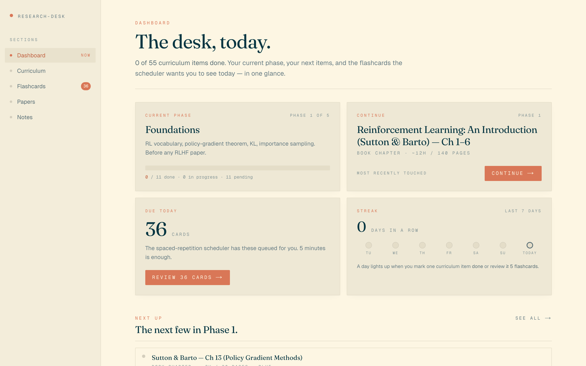

# Research Desk

A personal, static, local-first learning OS for transitioning from applied
MLE to frontier-lab post-training / RLHF research engineering.



- **Stack:** Next.js 15 (App Router), TypeScript strict, Tailwind v3, pnpm.
- **Persistence:** `localStorage` with a versioned schema
  (`research-desk:v1:*`), JSON export/import.
- **Testing:** Vitest + React Testing Library (149 tests).
- **Hosting:** static — deployable to Vercel or any static host. No server
  secrets required. No LLM calls at runtime.

## What's in the box

All five tabs are shipped and production-ready:

- **Dashboard** — current-phase card, Continue jump to the most recently
  touched item, next 3–5 items in the current phase, due flashcards CTA,
  weekly streak indicator, per-phase progress bars, and the
  Export / Import JSON controls.
- **Curriculum** — 55 curated items across 5 phases (Foundations → PPO
  & RM → DPO family + CAI → Reasoning RL → end-to-end) with real URLs
  (arxiv / openai / huggingface / github / …), mentor-voice focus notes,
  filters by phase / track / type / state, and a persisted side-sheet
  with per-item notes.
- **Flashcards** — 36 cards with SM-2 spaced-repetition scheduling
  (Again / Hard / Good / Easy), 3D flip animation, `Space` to flip and
  `1 2 3 4` to grade, ease / interval / reps drawer. Answers are
  paragraph-length and technically precise (PPO surrogate, DPO
  derivation, GRPO advantage, ZeRO stages, FlashAttention, …).
- **Papers** — 11 canonical papers (InstructGPT, PPO, Christiano '17,
  DPO, Constitutional AI, DeepSeek-R1 + GRPO, Let's Verify, ZeRO,
  FlashAttention v1 + v2, RLAIF) with 3–5 sentence editorial summaries
  and 5–7 pointed comprehension questions each. The "Reveal my answer"
  button only enables after you type ≥ 40 characters — you grade
  yourself against the paper.
- **Notes** — multi-page markdown notebook (3 default pages: Notes,
  Scratch, Weekly log), autosave with 250ms debounce, live preview
  side-by-side on desktop and a Write / Preview pill switcher on
  mobile. Markdown renderer is pure-React, scheme-filtered, no
  `dangerouslySetInnerHTML`.

## Setup

```bash
pnpm install
pnpm dev          # http://localhost:4747
```

## Build & run locally

```bash
pnpm build
pnpm start        # production server on :4747
```

## Quality gates

```bash
pnpm lint         # ESLint, zero warnings
pnpm typecheck    # tsc --noEmit, strict
pnpm test         # Vitest — 149 / 149
```

## Lighthouse

A committed report lives at [`lighthouse.json`](./lighthouse.json).
Scores on `/` (production build): performance ≥ 95, accessibility ≥ 95,
best-practices 100, SEO 100.

To regenerate:

```bash
pnpm build
pnpm start &              # serve the production build on :4747
pnpm lighthouse           # writes lighthouse.json at repo root
```

The `lighthouse` script runs headless Chrome against
`http://localhost:4747/` and emits the four category scores to
`./lighthouse.json`.

## Deploy

Research Desk is a fully static Next.js app — no server routes, no
API, no database, no secrets. Any static host works.

### Vercel (recommended)

```bash
pnpm dlx vercel            # interactive first deploy
pnpm dlx vercel --prod     # production release
```

No environment variables, no project settings beyond framework
auto-detection (Vercel picks up Next.js). Build command:
`pnpm build`. Output directory: `.next` (Vercel's default for
Next.js). The app is deployable from the repo root as-is.

### Netlify / Cloudflare Pages / any static host

1. Build: `pnpm build`.
2. Serve the generated `.next` output using the Next.js runtime
   provided by the host (Netlify's `@netlify/plugin-nextjs`,
   Cloudflare Pages' Next.js adapter). The app has no server
   actions, no API routes, and no runtime env vars, so every host's
   Next.js adapter works out of the box.
3. No custom headers required. `localStorage` is the only storage
   surface.

### Local tarball / file://

`pnpm build && pnpm start` serves on `:4747` with HTTP 200 on every
route. Because every route is prerendered (`○ (Static)` or `● (SSG)`
in the build output), you can also point any static server
(`python -m http.server`, `npx serve`) at `.next/server/app` after
running `next export`-style flow if you need a truly file-server
deploy.

## What lives where

- `app/` — App Router pages. `(tabs)` route group for the 5 tabs.
- `src/data/` — content modules: `curriculum.ts`, `flashcards.ts`,
  `papers.ts` (each with a structural Vitest suite).
- `src/lib/` — pure logic: `sm2.ts` (scheduler), `progress.ts`
  (reducer), `streak.ts` (weekly indicator), `storage.ts` (versioned
  localStorage + Export / Import), `notes.ts`, `markdown.tsx`.
- `src/state/` — React hooks that wrap the pure modules.
- `src/components/` — presentational components.
- [`ARCHITECTURE.md`](./ARCHITECTURE.md) — data model, persistence,
  how to add content.
- [`FINAL_GOAL.md`](./FINAL_GOAL.md) — hard acceptance criteria.
- [`WORKLOG.md`](./WORKLOG.md) — append-only iteration log.

## Aesthetic

Solarized Light (`#FDF6E3` cream base, `#EEE8D5` parchment panels,
`#586E75` slate text) with the Claude coral accent (`#D97757`) for
CTAs, active states, and progress fills. Serif headings (Fraunces),
sans body (Geist), mono identifiers (Geist Mono) in Solarized blue
`#268BD2`. No dark mode, no purple, no pure white. Section titles use
uppercase letter-spacing (`tracking-widest`) at 11–12px for
wayfinding labels — a Solarized-UI convention.

## Non-goals

- No accounts, no auth, no multi-user.
- No backend, no LLM calls at runtime. Everything runs from static
  files + `localStorage`.
- No mobile native app.
